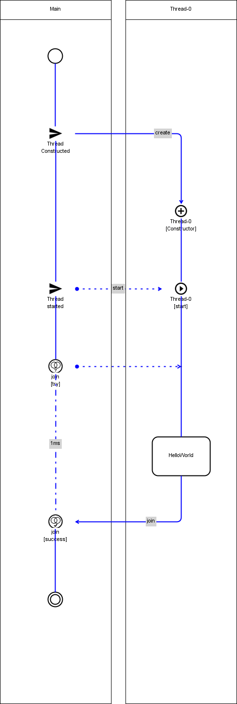
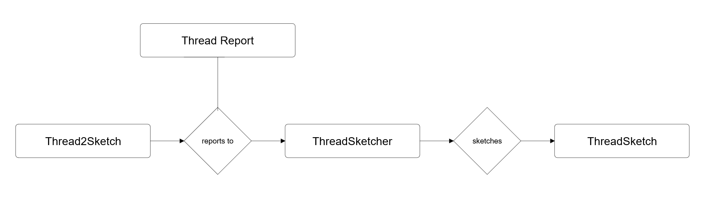
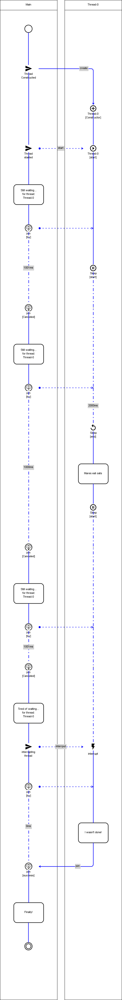

# threadSketch

_threadSketch_ is a Java library to support learning, teaching and understanding of congruent programming by sketching an illustration of the execution of all active Threads and their interactions __after runtime__.

_threadSketch_ was created with the goal to develop a solution that helps upcoming programmers to learn and understand congruent programming in Java.

_threadSketch_ supports a learning by doing approach to congruent programming:

##### You play around with congruent Java code, _threadSketch_ shows you how it executed.

### How can threadSketch help me?
Having troubles understanding the execution of Java code that contains multiple Threads?
_threadSketch_ shows you exactly what the 

### Is threadSketch hard to use?
Nope!
We want to help you learn congruent programming in Java, so we will not make learn more complicated stuff to use _threadSketch_!

_threadSketch_ is made to be as close to common congruent programming in Java as possible.
Code [Threads](https://docs.oracle.com/javase/8/docs/api/java/lang/Thread.html) and [Runnables](https://docs.oracle.com/javase/8/docs/api/java/lang/Runnable.html). 
as you know them, follow [four simple steps](four-steps) and _threadSketch_ draws a post-execution diagram that helps you understand how your code was executed.

# Example 
This is a simple HelloWorld example. For more complex examples see to [the SimpleThreads Example](#simple-threads-example) and the [example code](https://github.com/MSMetzger/ThreadSketch/tree/master/examples/examples).

## HelloWorld Example
### Code
```java

import threadSketch.ThreadSketcher;
import threadSketch.Thread2Sketch;
import static threadSketch.Thread2Sketch.threadPost;


public class HelloWorld implements Runnable {
    public void run(){
        threadPost("HelloWorld");
    }

    public static void main(String args[]) throws InterruptedException {
        //initialize the ThreadSketcher
        ThreadSketcher ts = new ThreadSketcher();

        //use Thread2Sketch instead of Thread
        Thread2Sketch t = new Thread2Sketch(ts, new HelloWorld());
        t.start();

        t.join();

        //sketch the output
        ts.sketch();
    }
}

```
### Output

# Getting Started
To use _threadSketch_, add the [threadSketch.jar](https://github.com/MSMetzger/ThreadSketch/blob/master/lib/threadSketch.jar) file from the lib directory to your Java project.
_threadSketch_ uses [mxGraph](https://github.com/jgraph/mxgraph) to create the illustration of the Thread(s) execution.

To get started, take a look at the [code examples](https://github.com/MSMetzger/ThreadSketch/tree/master/examples/examples) and the [how to guide](#how-to) prepared for you.

For _threadSketch_ to work correctly, you also need to add the [mxGraph](https://github.com/jgraph/mxgraph) library to your Java project.
If you want to dive deeper into how _threadSketch_ works, take a look at the [source.](https://github.com/MSMetzger/ThreadSketch/tree/master/src/threadSketch)

# <a name="how-to"></a> How it works
_threadSketch_ is composed of 4 main classes: _Thread2Sketch_, _ThreadReport_, _ThreadSketcher_ and _ThreadSketch_.



A _Thread2Sketch_ is a Thread that reports each status change as a _ThreadReport_ to a _ThreadSketcher_.
__After__ execution of the _Thread2Sketch_ has finished, the _ThreadSketcher_ can sketch a _ThreadSketch_ based on the _ThreadReports_ collected during runtime.

If you're learning and trying to understand congruent programming in java, you don't want to have to learn how to use a complicated library and make things even more confusing.
This is why _threadSketch_ is constructed in a way that allows you to code just like using common Threads in Java.

There are only 3 simple points that you have to keep in mind, and one additional feature:


<a name="four-steps"></a>
1. Initialize ThreadSketcher
2. Use Thread2Sketch instead of Thread
3. Sketch the ThreadSketch
4. (optional) Use ThreadPosts

## 1. Initialize ThreadSketcher
To use _threadSketch_, you have to initialize a _ThreadSketcher_ __before__ starting your Threads.
```java
    ThreadSketcher ts = new ThreadSketcher();
```
That's it. One simple line of code that you can paste at the top of your code.

## 2. Use Thread2Sketch instead of Thread
_threadSketch_ is based on the congruent programing concept of constructing [Threads](https://docs.oracle.com/javase/8/docs/api/java/lang/Thread.html) from [Runnables](https://docs.oracle.com/javase/8/docs/api/java/lang/Runnable.html). 

Instead of using the [Thread](https://docs.oracle.com/javase/8/docs/api/java/lang/Thread.html) class, simply use the _Thread2Sketch_ class.
This class overloads all methods from [Thread](https://docs.oracle.com/javase/8/docs/api/java/lang/Thread.html), so that you can use it in the exact same way.


##### plain Java:
```java
    Thread t = new Thread(new SomeRunnable());
    t.start();
```
 
 
##### threadSketch:    

```java
    ThreadSketcher ts = new ThreadSketcher();
    
    Thread2Sketch t = new Thread2Sketch(ts, new SomeRunnable());
    t.start();    
```
     
The only difference is the constructor, since you have to pass the monitoring _ThreadSketcher_.

Note that the [Runnable](https://docs.oracle.com/javase/8/docs/api/java/lang/Runnable.html). implementation is the same and does not require changes to be compatible with _threadSketch_.


## 3. Sketch the ThreadSketch
After executing your _Thread2Sketch_ implementations, you can let the _ThreadSketcher_ __sketch__ a flow chart of the executed _Thread2Sketch_ activity, the _ThreadSketch_.

```java
    ts.sketch();
```

That's it. One simple line of code that you can paste at the bottom of your code.

## 4. (optional) Use ThreadPosts
 When learning programming, printing stuff to the console is one of the essential tools to understand how your code executes.
 In _threadSketch_ you can have your Threads post messages that are displayed in the resulting _ThreadSketch_,
 by using the __threadPost__ method in the Runnable. 
 
 
```java
    public class HelloWorldRunnable implements Runnable{
        public void run(){
            threadPost("HelloWorld");
        }
    } 
```


# <a name="simple-threads-example"></a> The SimpleThreads Example
This example illustrates ThreadSketch on [the SimpleThreads Example](https://docs.oracle.com/javase/tutorial/essential/concurrency/simple.html).

## <a name="example-code"></a>Code 
```java

import threadSketch.ThreadSketcher;
import threadSketch.Thread2Sketch;

/**
 * This Example implements the Simple Threads Example found here:
 * https://docs.oracle.com/javase/tutorial/essential/concurrency/simple.html
 * using ThreadSketch.
 */
public class Example { 

    private static class MessageLoopReporter implements Runnable {
        public void run() {
            String importantInfo[] = {
                    "Mares eat oats",
                    "Does eat oats",
                    "Little lambs eat ivy",
                    "A kid will eat ivy too"
            };
            try {
                for (int i = 0;
                     i < importantInfo.length;
                     i++) {
                    // Pause for 2 seconds
                    Thread2Sketch.sleep(2000);
                    // post a message in the TreadSketch
                    Thread2Sketch.threadPost(importantInfo[i]);
                }
            } catch (InterruptedException e) {
                //post a message in ThreadSketch
                Thread2Sketch.threadPost("I wasn't done!");
            }
        }
    }

    public static void main(String args[])
            throws InterruptedException {

        // patience, in milliseconds before we interrupt MessageLoop thread
        long patience = 3000;
        long startTime = System.currentTimeMillis();

        //initialize a ThreadSketcher
        ThreadSketcher ts = new ThreadSketcher();

        MessageLoopReporter rn = new MessageLoopReporter();

        // creates a Thread2Sketch, assigned to a ThreadSketcher and implementing a given Runnable
        Thread2Sketch t = new Thread2Sketch(ts, rn);
        t.start();


        while (t.isAlive()) {
            //post a custom message in ThreadSketch
            Thread2Sketch.threadPost("Still waiting...\nfor thread:\n" + t.getName());

            // Wait maximum of 1 second
            // for MessageLoop thread to join
            t.join(1000);

            //interrupt when patience is exceeded
            if (((System.currentTimeMillis() - startTime) > patience)
                    && t.isAlive()) {

                //post a custom message in ThreadSketch before interrupting
                Thread2Sketch.threadPost("Tired of waiting...\nfor thread:\n" + t.getName());
                t.inthappened();
                // Shouldn't be long now
                // -- wait indefinitely
                t.join();
            }
        }

        //post a custom message in ThreadSketch when join was successful
        Thread2Sketch.threadPost("Finally!");


        //The single line of code that makes the ThreadSketcher sketch a ThreadSketch of everything that happened above
        ts.sketch();


    }
}
`````

## Output
 
 
# License
ThreadSketch is licensed under the Apache 2.0 license.

